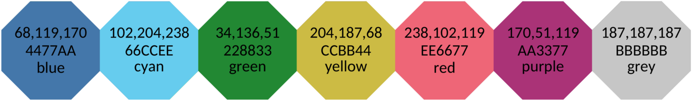
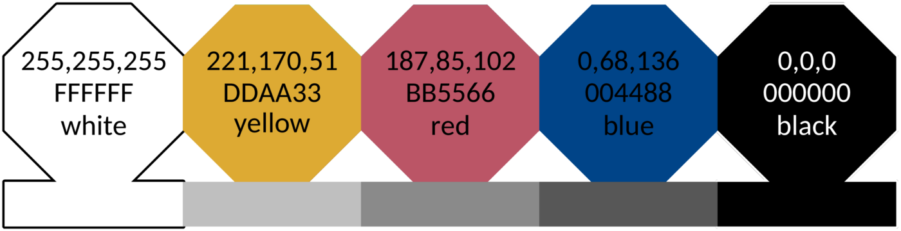
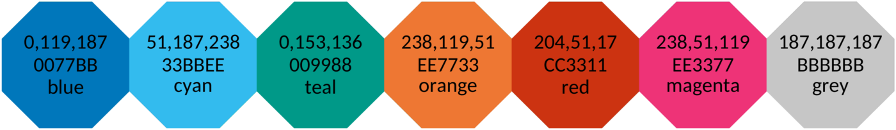
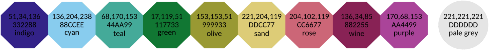

# はじめに
データを可視化するにあたり、使用する色を慎重に選ぶことでより明確にそれぞれのデータを識別することができる。以下のように、あらかじめデータに対応する色を設定しておくことはデータの可視化において有用である。

- 色合いの区別が苦手な人も含めた、全ての人に対して明瞭な色使いであること
- 白黒はっきり区別がつくこと
- 画面と紙の両方において区別がつく色使いであること
- 使用している色の相性がよいこと

ここでは、数学的な観点で考えられた色使いと色の認識が得意でない人の2つの主要な色覚について示す。配色は、示されたデータの種類を反映するようなものでなくてはならない。データには基本的に以下のような3つ種類のものがある。

- [定量的データ](#定量的データ) - 重要度に差異がないような名称やカテゴリー。テキストや図中の線にも対応する
- [分散データ](#分散データ) - 平均やゼロからの正負の偏差のように、中間値が2つの極値の間にあり、順序付けされてるようなデータ
- [連続的データ](#連続的データ) - 低値から高値に並んでいるようなデータ

以下の章でこれらのデータに対する配色について述べる。他のトピックは以下のものとなる。

- 色覚異常の人がおおよそどのように色を見ているかの情報
- これらの配色がモノクロ画面や印刷時にうまく作用することと、最適な使用方法についてのヒント
- AVHRRによる地表分類のための明確な配色
- 伝統的な悪い虹色の配色と、より少ない色でよく見せる方法
- データ分析の分割と地図の生成方法について <!-- 微妙な翻訳 -->
- SRON(オランダ宇宙研究所)のLaTeXとPowerPoint用のテンプレート

# 定量的データ
ここでは定量的データに対しての基本的な配色はFig.1のようにする。RGB色座標はRGBカラーモデルにより構成され、Fig.1中の上の数値は10進数表記を、真ん中の値は16進数表記したものである。

&emsp;&emsp;Figure.1 : 色覚に以上がある人にも対応した明色

より少ない色で表現したコントラストの高い表現は以下のFig.2ようなものである。これはグレースケールに変換した場合にも対応する。

&emsp;&emsp;Figure.2 : コントラストの高い配色．Fig.1の明色のものに代わるもので，色覚異常の人にも対応し，コントラストを最適化したものである．Fig.2中の下に表されているものは，同じ輝度でグレースケールにしたものである．この配色は白黒印刷などにおいても効率の良い視覚的な効果を生むことができる．

もう1つの代案として，鮮やかな配色のFig.3である．これはデータ可視化フレームワークのTensorBoardに使用されている．

&emsp;&emsp;Figure.3 : Fig.1の代案である鮮やかな配色．

3つめの案としてFig.4にある抑えた色使いがある。これは多くの色を含んでいるが、赤と青が欠落したものとなっている。<!--要見直し-->

&emsp;&emsp;Figure.4 : 発色が抑えられた配色．

4つめの案としてFig.5にある中程度のコントラストの配色がある。3つの色のペアがあり、コントラストが高いものほどではないにしろグレースケールでうまく作用する。

&emsp;&emsp;Figure.5 : 中程度のコントラストの定量的配色で、Fig.2の色盲の人に対しても配慮のある高いコントラストの配色より多くの色を用いたもの。これはモノクロ印刷の際のコントラストに最適化されているが、必然的に差異が小さくなる。下半分がグレースケールになった長方形の図からわかるように、色の組み合わせを必要とするような状況のためにデザインされている。

明色やハイコントラスト、鮮やかなもの、発色を抑えたもの、中程度のコントラストの配色などは線を描いたり地図の地域分けをする際には役立つが、通常の表で文字の背景色として用いるには色の主張が強く不向きである。そのような目的のために、淡い配色(Fig.6の上部)が作られた。この配色の本質はそれぞれの色を明確に区別できるものではなく、白の範囲ではっきりと区別がつくものとなっている。

# 分散データ

# 連続的データ

# 色盲
人が色盲かどうかは普通幼い段階で発覚する。しかし、色の見えにくさにはそれぞれ微妙な差異がある。2つの主なタイプとして、

* 緑色盲 : 網膜中の中長波を感じ取る錐体細胞が欠落しているか、赤寄りの応答を示す。(男性の6%、女性の0.4%)
* 赤色盲 : 網膜中の長波を感じ取る錐体細胞が欠落しているか、緑寄りの応答を示す。(男性の2.5%)

